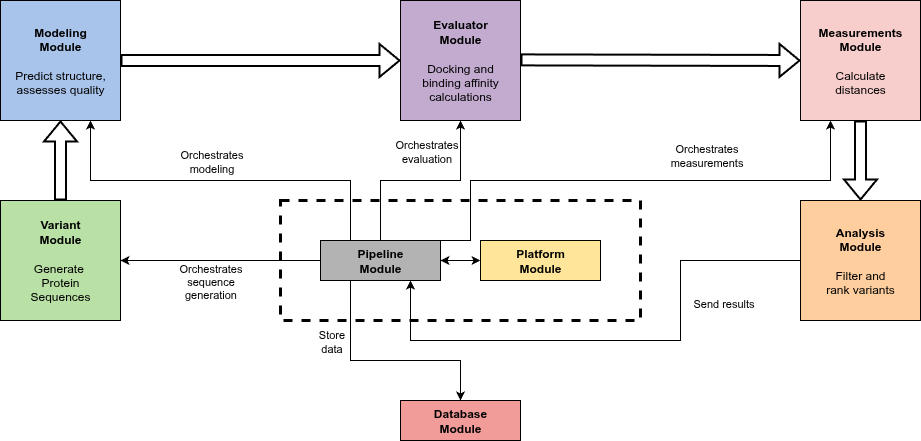

Overview
========

.. figure:: _static/images/cover2.png
   :alt: GDEE Platform Banner
   :width: 800px
   :align: center

|

What is GDEE?
-------------

**Gene Discovery and Enzyme Engineering (GDEE)** is a comprehensive Python package that provides the functionality necessary to run the Gene Discovery and Enzyme Engineering Platform developed under the project ShikiFactory 100 (European Union's Horizon 2020 research and innovation programme under grant agreement number 814408).

GDEE integrates multiple computational approaches for protein engineering, enabling researchers to design, model, and evaluate protein variants through automated workflows.

How do I install GDEE?
----------------------

GDEE requires several external software dependencies and Python packages. Installation involves setting up both the computational tools and the Python environment.

**Prerequisites**

Before installing GDEE, you need to install the following external software:

- **MODELLER**: Required for homology modeling (academic license needed)
- **AutoDock Vina**: For molecular docking calculations
- **Smina**: Alternative docking tool with Vinardo scoring
- **MGLTools**: For structure preparation and PDBQT file generation
- **VoroMQA**: Optional, for model quality assessment using Voronoi analysis

**Python Package Installation**

GDEE can be installed directly from the source:

.. code-block:: bash

   cd gdee/package
   pip install .

**Dependencies**

GDEE automatically installs the following Python dependencies:

- numpy (≥1.14) - Numerical computations
- mdanalysis (≥0.20) - Molecular structure analysis
- mpi4py (≥3.0) - Parallel computing support
- path.py (≥13.0) - Enhanced path operations
- biopython (≥1.75) - Biological sequence handling
- oddt (≥0.7) - Cheminformatics toolkit
- openbabel-wheel (≥3.1.1.1) - Molecular file format conversions
- six (≥1.17.0) - Python 2 and 3 compatibility
- scipy (==1.9.0) - Scientific computing

For detailed installation instructions, see the :doc:`Installation` guide.

How can I use GDEE?
-------------------

GDEE provides a high-level Python interface through the `ProteinEngineering` class. Here's a basic workflow example:

**Basic Usage Example**

.. code-block:: python

   from gdee import ProteinEngineering

   # Initialize the protein engineering platform
   engineer = ProteinEngineering("my_protein", "results.db")

   # Set the template PDB structure
   engineer.pdb = "template.pdb"

   # Configure variant generation (mutation-based approach)
   engineer.variant["name"] = "mutation"
   engineer.variant["matrix"] = "blosum62"
   engineer.variant["selection"] = "A:100 A:150 A:200"  # Residues to mutate
   engineer.variant["max_iterations"] = 100
   engineer.variant["conservative"] = True

   # Configure modeling parameters
   engineer.model["name"] = "modeller"
   engineer.model["num_models"] = 5
   engineer.model["optimize_level"] = 1

   # Add ligand for docking
   ligand = engineer.add_ligand("substrate", "ligand.pdbqt")
   # Add distance measurement between cofactor and ligand using MDAnalysis selection syntax
   ligand.add_measurement("cofactor-ligand", "distance",
                         "chainId A and resid 195 and name N4", "name C1")

   # Configure docking parameters
   engineer.evaluator["name"] = "vina"
   engineer.evaluator["box_center"] = [10.0, 15.0, 20.0]
   engineer.evaluator["box_size"] = [20.0, 20.0, 20.0]
   engineer.evaluator["exhaustiveness"] = 100

   # Run the engineering campaign
   engineer.run()

**Key Configuration Options**

- **Variant strategies**: Choose between "mutation", "msa", or "exhaustive" approaches
- **Selection syntax**: Specify residues using MDAnalysis selection strings
- **Quality thresholds**: Set DOPE and VoroMQA cutoffs for model filtering
- **Parallel execution**: Configure MPI settings for distributed computing
- **Output management**: Control file organization and compression
- **Re-Scoring**: Optionally re-score docking poses with trained metamodel for improved ranking

For comprehensive examples and advanced usage, see the :doc:`Usage` guide.

How does GDEE work?
-------------------

GDEE implements a modular pipeline architecture that processes protein variants through multiple computational stages. The workflow is designed to be both automated and highly configurable.

**Pipeline Architecture**

The GDEE pipeline consists of the following sequential steps:

1. **Variant Generation** → 2. **Structure Modeling** → 3. **Quality Assessment** → 4. **Molecular Docking** → 5. **Distance Measurements** → 6. **Data Storage**

   High-level diagram illustrating the architecture and data flow of the platform. The Core functions as the central orchestrator coordinating and scheduling task execution across specialized modules in a linear pipeline workflow – Variant, Modeling, Evaluator, Measurement, and Analysis – each dedicated to specific tasks on protein variants. The Variant module generates amino acid sequence variants using different strategies; the Modeling module predicts 3D structures and assesses their quality; the Evaluator module performs docking and binding affinity calculations; the Measurement module calculates distances between selected protein and ligand atoms to assist in filtering; and the Analysis module applies filters and ranks variants accordingly. Data flows between processing modules are represented by bold arrows, while narrow arrows indicate the Core orchestration and management of operations. All intermediate and final results are centralized in the Database module, providing efficient data storage and retrieval for downstream analysis.

**Detailed Workflow**

**Step 1: Variant Generation**
    GDEE supports multiple strategies for generating protein variants:

    - **MSA-based variants**: Generate variants based on FASTA file (Can result from a BLAST search - Gene Discovery)
    - **Matrix-based mutations**: Use substitution matrices (BLOSUM62 or custom) for guided mutations
    - **Exhaustive combinatorial mutations**: Systematically explore all possible combinations
    - **Conservative vs. non-conservative mutations**: Control mutation bias based on amino acid properties

**Step 2: Structure Modeling**
   - Uses MODELLER to create 3D structural models for each sequence variant
   - Generates multiple models per variant to account for conformational uncertainty
   - Performs local optimization focused on mutated regions to minimize computational cost

**Step 3: Quality Assessment**
   - Evaluates each model using Normalized DOPE scores from MODELLER
   - Optionally applies VoroMQA for additional quality validation
   - Filters out low-quality models based on user-defined thresholds

**Step 4: Molecular Docking**
   - Prepares protein models in PDBQT format using MGLTools
   - Performs molecular docking using AutoDock Vina or Vinardo scoring
   - Generates multiple binding poses per protein-ligand complex

**Step 5: Distance Measurements**
   - Calculates user-defined distance measurements between protein and ligand atoms
   - Stores distance measurements for each pose

**Step 6: Data Storage**
   - Saves all results to a SQLite database with hierarchical organization
   - Archives output files (PDB models, docking poses) in compressed format
   - Maintains data integrity through transactional database operations

**Supported File Formats**

- **Input**: PDB files for template structures (protein), PDBQT files for ligands
- **Output**: PDB files for models, PDB files for docking poses
- **Database**: SQLite format for persistent storage
